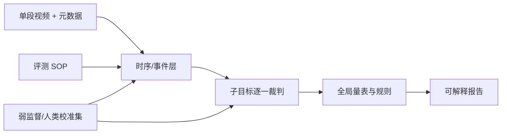

# 世界模型驱动人形机器人：任务评估 SOP 自动生成与视频自动打分 设计说明

> 目标：在「每类任务约 10 条样本」的约束下，**自动生成可执行的测试评分 SOP**；在**单次任务测试视频**输入下，**按 SOP 自动给出多维度分数**，支撑上百类任务、每类 200+ 条采集数据与日常回归评测。

---

## 1. 问题与目标

| 维度 | 说明 |
|------|------|
| **规模** | 任务类型多（百级），每类有大量采集数据；测试时只关心**当前被测世界模型在单任务上的行为**。 |
| **人的诉求** | 对复杂任务**分步打分**（如倒水：抓瓶、倒水、放瓶），并兼顾**总时长、动作平滑度、安全性**等。 |
| **自动化诉求** | 不手写每类任务几百页细则：用**少量样例**生成该类任务的**评测 SOP**，再用**摄像头录制的单段视频**自动出分。 |

**成功标准（建议量化）**：

- SOP 可被**程序与评测员**同时读懂（结构固定、可版本化）。
- 自动分与**人类专家**在抽样任务上的**相关性**达到约定阈值（如 Spearman ≥ 0.7，按业务定）。
- 单任务**端到端评测时延**可接受（如分钟级，取决于视频长度与算力预算）。

---


## 2. 核心概念

### 2.1 什么是「评测 SOP」

不是流水账文案，而是**可机器解析的评分规约**，建议至少包含：

- **任务元信息**：`task_id`、自然语言名、风险等级、建议视角（如俯视/侧视）。
- **阶段/子目标列表**：每个子目标有**名称、可观测判据、权重、是否一票否决**。
- **全局量表**：如最大允许时长、平滑度是否考核、安全红线（倒伏、碰撞等）。
- **计分与聚合规则**：子项加权、封顶、失败级联（某步失败是否整段记 0 分）。

这样后续无论是 **VLM+规则** 还是 **VLM+LLM 裁判**，都对着同一份规约执行。

### 2.2 数据在系统中的角色

- **200+ 条/任务采集数据**：用于训练世界模型、数据挖掘、难例发现；**不必全部**进「SOP 生成」环节。
- **10 条/任务「种子样本」**：专门选来做 **SOP 归纳**——应覆盖**成功/部分失败/典型歧义**（如洒水的边界），否则生成的判据会偏虚。

---

## 3. 整体架构（推荐）

```
[每任务 10 条种子] ──▶ SOP 生成器 ──▶ [评测 SOP 版本 vN] ──▶ 规约库
                                    │
[测试时单段视频]  ──▶ 理解层(时间线+事件) ──▶ 计分层(对齐 SOP) ──▶ 报告+可追溯日志
         │                    ▲
         │                    │ 可选：状态/关节/力
[机器人状态流]  ─────────────┘
```

- **SOP 生成**与**视频打分**解耦：SOP 更新频度低、可审核；**模型版本 × SOP 版本** 绑定出报告，便于对比。
- **多模态理解**以视频为主；若机器人能回传 **关节/末端位姿/力矩**，对「平滑度、是否成功对接」等应**显著提高可靠性**，建议中长期必接。

---

## 4. 「每任务 10 条数据 → 自动生成 SOP」方案

### 4.1 对「10 条数据」的最低要求

为生成**可检核**的 SOP，单条数据最好包含**至少一种**（越多越好）：

| 模态 | 作用 |
|------|------|
| 短视频片段 | 供模型归纳**真实可见的成功/失败形态** |
| 子步骤时间戳 / 行为标签 | 将长视频切成「阶段」 |
| 简短文字说明 / 人类备注 | 歧义时作为监督信号 |
| 量化的失败类型（如洒、滑、未对准） | 写进 SOP 的**否决或扣分项** |

若当前只有**纯视频、无标注**，可先做一轮**弱监督**：用通用 VLM 对 10 段做 **粗分阶段 + 问题描述**，再**人工快审** 1 轮，比从零写 SOP 仍省工。

### 4.2 生成管线（可落地的一种）

1. **归一化输入**：10 条样本拉齐到统一 schema（视频 URI、起止、已有标签、传感器可选）。
2. **跨样例聚类/对齐**：在「子目标」粒度上，把不同样本映射到**同一套阶段骨架**（如 倒水 → 找物–抓取–倾倒–复位）。
3. **规则 + 大模型归纳**（推荐主路径）  
   - 用 **LLM/多模态大模型**根据样本差异，**起草**每阶段的**可观测通过条件**（用摄像头能看到什么、看到什么算失败）。  
   - 用**固定 JSON Schema** 强约束输出，避免散文式 SOP。
4. **矛盾检测**：若 10 条中同一阶段通过条件互斥，输出 **「需人工定夺」** 的清单，而不是硬合并。
5. **版本与审计**：SOP 写入库时带 `generated_from`（10 条样本 id）、`prompt_version`、`model_version`，便于回滚与复现。

### 4.3 可选增强

- **模板库**：为「操作物体」「液面」「锐器」等**危险度不同**的类别套不同**默认子目标模板**，生成器只做填空与微调。  
- **小样本学习（可选）**：对「好/坏片段」学 embedding 边界，**不替代**显式 SOP，可作为**对 VLM 裁判的纠偏**或**难例二筛**。

---

## 5. 测试时：「单段视频 → 自动打分」

### 5.1 理解层：先建时间线，再对齐 SOP

推荐两阶段，而不是「一段视频一个总分」：

1. **时序切分/事件检测**  
   - 输入整段视频（可加关键帧/滑窗）。  
   - 输出：**阶段区间**、每段内**自然语言/结构化事件**（如「瓶口离开杯口」「水线可见外溢」）。  
   - 技术选项：**视频-语言大模型**、**帧采样 + VLM 滑窗**、**轻量动作检测头**（若固定机位、背景稳定）。

2. **与 SOP 对齐的评分**  
   - 将事件序列映射到 SOP 中的子目标。  
   - 对每个子目标算：**二值完成/部分完成/置信度 + 子理由**；再按 SOP 权重聚合。  
   - 对**全局量表**：在整条时间线上算 **时长、平滑度代理指标** 等（见下）。

### 5.2 可计算的「全局」指标（建议）

| 指标 | 有视频-only | 有 state |
|------|-------------|----------|
| 总时长 | 起止时间戳 / 与 SOP 建议上界比 | 同左或用语义事件界定 |
| 动作平滑度 | 光流/表观运动幅度的 jerk 代理；**噪声大** | 对关节/末端速度、加速度的 jerk 更可靠 |
| 安全 / 稳态 | 人形大机动下的跌倒、剧烈碰撞的**视频启发式**；宁可标「低置信」 | 接触力、平衡状态优先 |

> **说明**：仅摄像头时，「水是否真正倒入杯内」可能**不可见**；SOP 里应对这类项标注 **可观测性等级** 或要求**补充视角/俯视**，否则自动分以**不确定度**标出，避免假精确。

### 5.3 计分与可解释性

- 每份报告包含：**子项分、子项原因、时间片段引用（起止秒）**、**不确定度/跳过的子项**。
- 保留**原始 VLM/模型输出**与**解析后结构化结果**，满足**可审计**与**bad case 复现**。

### 5.4 与人打分对齐（强烈建议固定周期做）

- 从每类任务抽少量视频，人评 vs 自动分，**线性校准**或**秩相关**。
- 系统性地收集 **SOP 缺陷** 与 **视频判错**，回流优化 **SOP 文本** 与 **提示词/模型**，形成闭环。

---

## 6. 评估子系统：推荐技术架构

「评估模型」不建议做成**一个端到端黑盒从视频直出总分**；更稳、可审计的做法是**模块化裁判流水线**：各模块可独立替换、单独评测与**单独训练/校准**。

### 6.1 总览：五段式



| 模块 | 职责 | 典型技术 |
|------|------|----------|
| **A. 规约解析器** | 把 SOP JSON 拆成**可执行检查项**（阶段顺序、权重、否决、可观测性） | 不用学习；小代码 + schema 校验 |
| **B. 时序与事件** | 输出时间线、区段、事件短语（可映射到 SOP 阶段 id） | 长视频**滑窗 VLM** 或**视频-语言大模型** + 后处理合并；有固定机位时可选**轻量时序 TCN** 辅助“阶段边界” |
| **C. 子目标裁判** | 对 `(片段, 判据文本)` 输出 **通过/部分/不通过 + 置信度 + 引用的秒级证据** | **VLM/MLLM** + **按 SOP 的 prompt**；复杂场景用 **(片段, 判据) 多对一** 分类头 |
| **D. 标量/物理项** | 时长、可观测范围内的平滑/抖动、简单安全启发式 | **有 state/IMU/力**：jerk 等从轨迹算；**仅视频**：光流/表观运动粗代理 + 标**不确定度** |
| **E. 聚合与校准** | 按 SOP 权重复合、否决逻辑、**与人打分的线性/分段校准** | 规则 + 可学习 **标量偏置/温度**（在固定校准集上 fit） |

**设计原则**：

- **SOP 是唯一真源**（可版本、可 diff）；模型只在「如何把像素对齐到 SOP 文本」上变聪明。  
- **不强迫不可见项打高分**：C 对 `observability: low` 的项输出 **N/A 或宽不确定度**，D/E 不瞎补数。  
- **可解释**优先于「多扣两分」：子项**必须**带回时间戳与一句理由，便于人审和迭代数据。

### 6.2 主路径选型（与成本/时延的权衡）

| 路线 | 结构 | 适用 | 注意 |
|------|------|------|------|
| **强 MLLM + 工具** | B/C 用同一 7B–70B 级 MLLM，**滑窗/关键帧**喂入，**JSON tool-calling** 出事件与分项 | 快速冷启动、任务多 | 时延与费用；要**去幻觉**的 schema/校验 |
| **VLM 骨干 + 小型 LoRA/Adapter** | 开源 VLM 冻结，LoRA 只训「机器人/室内/多任务裁判」 | 有持续标注预算、要私有化 | 数据质量比数量更重要 |
| **双级** | 小模型/规则做**粗分段时间线**，大模型只做**难段/争议段**的精细裁判 | 视频长、QPS 有要求 | 两级**接口契约**要定死，避免误传播 |

**落地建议**：先用**闭源/开源强 MLLM 单路径**把基准与人一致性跑通，再**只对「裁判 + 时间线」做强 LoRA**，SOP 生成可保持 **API/强 prompt**，除非你有大量**专家写的 gold SOP**再考虑 SFT。

### 6.3 SOP 自动生成（与「裁判模型」的边界）

- **SOP 生成**本质是 **(多段种子视频/标签) → 结构化规约**；**不必**与**同一**视觉骨干共享权重。  
- 可单独用 **MLLM/LLM + JSON 约束**；有 gold 数据后再 **SFT**「种子包 → 审核后 SOP」。  
- 裁判网络（B+C）**只吃「已定稿 SOP + 测试视频」**；SOP 迭代与裁判权重**解耦**，避免一条链路同时漂移两处。

---

## 7. 如何训练与迭代

下面按**是否有足量带标签视频**分档说明；**10 条/任务**更偏**规约冷启动**，**不应用来端到端大训裁判骨干**（易过拟合、泛化到新机位/新场景差）。

### 7.1 数据分层（建议固定进平台）

| 数据类型 | 规模预期 | 用途 |
|----------|----------|------|
| **A. 每任务 10 条种子** | 小 | **归纳/初版 SOP**、矛盾检测；不支撑重训 7B+ VLM |
| **B. 裁判校准集** | 每类任务 30–200 条视频（可逐步长） | **有帧级/片段级人标或多人打分**，用于 LoRA、DPO、**校准** |
| **C. 时序/阶段标签** | 在 B 上逐步补 | 训练/微调 **B 时序与事件**头或滑窗后处理 |
| **D. 成对比较** | “同任务两条轨迹谁更好” | **DPO / Bradley–Terry**，改善与人类排序一致 |

**标注形态（优先）**：每条视频 = **(阶段区间集合 或 事件点序列) + 每子目标等级 + 总印象分（可选）**；**至少**有 **Inter-rater 子集**算一致性。

### 7.2 冷启动（0 → 可上线）

1. 选 **1–2 个任务**做试点，定 **SOP JSON schema** 与报告模板。  
2. 用 **强 MLLM + 固定 system prompt** 跑通 B/C（滑窗+合并策略写死）。  
3. 人工对 **N≈20–50 段** 视频做**金标或纠偏**，用于：  
   - 调 **prompt/温度/合并规则**；  
   - 统计 **N/A/不确定度** 比例，**反改 SOP 可观测性**（比盲训网络更有效）。  
4. 在试点集上达到约定 **人–机相关** 再扩类。

### 7.3 监督式微调（适合：阶段边界、子目标判定）

- **时序/事件**  
  - 有 `(视频, 阶段边界或事件表)` 时，可训**滑窗 VLM 的分类头**或**独立时序头**；  
  - 弱标签可用 **伪标 + 人工修** 迭代。  
- **(片段, 判据) 判定**  
  - 监督：交叉熵 / **序数回归**（0/0.5/1）。  
  - 骨干：冻结 VLM 或**浅 LoRA**（rank 8–32），**优先训高层语言侧 + 多模态 projector**（依具体架构而定）。  

### 7.4 偏好/排序学习（适合：标量分难统一、但「谁更好」好标）

- 收集 **(rubric, video_a, video_b, prefer)** 或 **人类总分序**。  
- **DPO / IPO / 类似偏好损失** 挂在**同一**裁判输出上，**勿与**世界模型训练混在同一损失里（职责分离）。  
- 可与 7.3 混用：**SFT 打底 + 偏好小步**。

### 7.5 分布局部校准（低成本高收益）

- 在固定**校准集**上，对自动打的**子项/总分**做 **Platt/温度/分段线性** 与 **ECE/相关** 监控。  
- **SOP 版本**更换时，**重跑校准**或保留「旧 SOP 映射」以可比历史分。

### 7.6 什么不该做

- **用 10 条种子重训 7B+ 视频模型** —— 信噪与覆盖不够，**优先补 B 与改 SOP**。  
- **端到端「视频 → 一标量分」** 而无可解释子项 —— 难调试、与业务 SOP 易脱节。  
- **忽略**机位/光照/遮挡 —— 在报告与训练里**显式 domain 标签**，回归集分层汇报。

### 7.7 与「世界模型」训练的关系

- 评估子系统**不应**为拟合被测世界模型而训练；**裁判数据**应含**多版本策略/多模型**产生的视频，避免**裁判–策略共生偏置**。  
- 若用评估信号去训世界模型，应走**独立**标注管线或**held-out 裁判**避免泄漏。

---

## 8. 技术栈与实现形态（供选型）

| 环节 | 选项 A（易起步） | 选项 B（更深整合） |
|------|------------------|--------------------|
| SOP 结构 | **JSON Schema + 自有存储** | 与现有 MLOps/实验平台表结构打通 |
| SOP 生成 | 闭源 MLLM API + 强 schema | 开源 MLLM 私有化部署 |
| 视频理解 | API/开源 VLM + 时序后处理 | VLM + **机器人状态** 多模态融合（推荐中长期） |
| 部署 | 离线评测机 / 队列 + GPU 节点 | 与机器人操控系统同网段、低时延回传元数据 |

---

## 9. 风险与缓解

| 风险 | 缓解 |
|------|------|
| 十段样本有偏，SOP 过拟合 | 难例/失败类型分层抽样；SOP 发布前**最小人工审核** |
| 单视角看不清关键判据 | SOP 标注可观测性；**多机位/关键帧**规范；力/位姿能接则接 |
| 自动分与主观分漂移 | 定期人评对齐；**版本化**SOP 与**校准集** |
| 成本与延迟 | 子集任务用**轻量模型**；**长短视频分层**；缓存中间特征 |

---

## 10. 分阶段实施建议

1. **Phase 0（2–3 周）**  
   定 **JSON 版评测 SOP** 与 1 个任务的**人机双评**试点；不追求全自动。
2. **Phase 1**  
   实现 **10 样例 → SOP 生成器** + **人工快审**发布流程。
3. **Phase 2**  
   接 **单段视频 → 时间线 → 按 SOP 出分**，打通报告与**不确定度**。
4. **Phase 3**  
   接 **state/力/多视角**；建立**回归集**与**分数校准**闭环。

---

## 11. 附：SOP 顶层结构示例（非规范，仅示意）

```json
{
  "task_id": "pour_water_001",
  "version": "1.0.0",
  "stages": [
    {
      "id": "locate_bottle",
      "name": "定位并接近水瓶",
      "pass_criteria": "末端接近瓶身可抓取区且无明显持续碰撞",
      "weight": 0.2,
      "veto": false
    }
  ],
  "global": {
    "max_duration_s": 120,
    "smoothness": { "required": true, "weight": 0.1 }
  },
  "aggregation": "weighted_sum_with_veto"
}
```

---

## 12. 小结

- **评测 SOP** 宜做成**结构化、可版本、可机读**的规约；**10 条种子**用 **多模态归纳 + 固定 schema + 少人工定夺** 是现实主路径。  
- **自动打分**宜 **先时间线/事件、再按 SOP 计分**（第 6 节模块化「裁判」），并显式处理**不可见判据**与**不确定度**；能接**机器人状态**时优先接入以稳住平滑度与细粒度成功定义。  
- **训练**应以**校准集与偏好/监督数据**为主（第 7 节），**10 条不用于大训骨干**；冷启动用强 MLLM + 规则/校准迭代，再视预算做 VLM 上的 **LoRA / 偏好学习**。  
- 把 **SOP 版本、种子样本、模型版本、视频与原始裁判输出** 全链路存证，才能支撑**上百任务**上的长期迭代与**回归对比**。

---

*文档为架构与方案梳理，具体字段与阈值需与业务、安全、法务一起定稿。*
